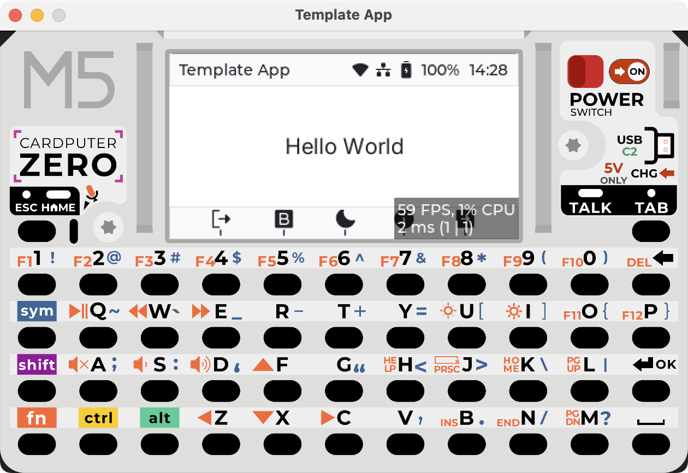

# JellyZero

**v0.0.3: Cardputer Zero Spotify controller.** Real Spotify sign-in (PKCE,
no Client Secret on the device) and live playback control — the Now Playing
screen shows your actual current track, cover art, and progress, and the
physical keys drive real play/pause/skip/seek/volume against your account.
Jellyfin is still an offline placeholder. See [Spotify setup](docs/spotify-setup.md)
to connect your account, and [controls, build and tests](docs/v0.0.1.md) for the
underlying UI/build docs.
Store submission metadata below remains scaffold material, not a publishable release.
See the [security and efficiency review](docs/v0.0.1-audit.md) for verified checks and remaining hardware/release gates.

---

<p align="center">
  <picture>
    <source
      media="(prefers-color-scheme: dark)"
      srcset="./screenshot/app-simulator-dark-darwin.png"
    />
    <source
      media="(prefers-color-scheme: light)"
      srcset="./screenshot/app-simulator-light-darwin.png"
    />
  
  </picture>
</p>

<div align="center">
    <h1>CardputerZero Application Template</h1>
</div>

<div align="center">
  <p>A simple starter template for building embedded Linux GUI applications with LVGL and CMake.</p>
</div>

<p align="center" style="margin: 20px 0; display: flex; justify-content: center; flex-wrap: wrap; gap: 12px;">
  
  
  
  
</p>

<p align="center">
  <a href="https://discord.gg/ysQAWBUE9Q">
    
  </a>
</p>
It is intended to be used as a clean development baseline: desktop builds use an SDL hardware-accelerated compositor for fast UI preview, while device builds use the Linux/LVGL platform drivers.

## Project Overview

In this example project, we used small MVVM-style structure around LVGL:

- **UI layer**: screens and widgets are implemented with LVGL objects. `BaseScreen` owns the page root, title bar, nav bar, and page content. Widgets derive from `BaseWidgets` and expose a `build()` entry point.
- **Data model**: `BaseModel` stores application state such as current page and theme mode.
- **View model**: `BaseViewModel` exposes model state as LVGL observer subjects and provides UI actions such as page switching, counter updates, theme toggle, and quit request.
- **Reactive/data binding**: `src/reactive` wraps LVGL observer subjects and common bindings so labels, styles, flags, widget values, and events can be connected to application state.
- **Data flow**: user input triggers widget callbacks, callbacks update `BaseViewModel`, view model publishes subjects, and bound UI objects refresh automatically through LVGL observers.
- **Platform layer**: platform code owns Linux input integration and other hardware-facing services. The nav bar maps hardware/keyboard keys `4` to `8`, plus `ESC` for quit.

Current UI:

- **Now Playing (Apple screen)**: title/artist/album, progress bar, volume, and cover art. Shows
  real, live Spotify data once signed in; otherwise an offline demo preview, including a
  five-item queue (Spotify's real queue isn't fetched yet, so the queue panel stays blank while
  Spotify is the live source).
- **Source picker (Butter screen)**: choose between Spotify and Jellyfin. Spotify's row shows
  real sign-in status ("Signed in as `<name>`" or "sign-in not configured"); Jellyfin stays a
  placeholder ("server not configured").
- Light/dark theme toggle and page navigation remain from the base template.

## Repository Layout

```text
.
├── assets/                 # Runtime assets used by the app
│   ├── applications/       # Desktop/app launcher metadata
│   ├── audio/              # Audio resources
│   ├── fonts/              # TTF fonts loaded through FreeType
│   └── images/             # Image resources
├── docs/                   # Setup/audit docs, incl. spotify-setup.md
├── screenshot/             # Simulator screenshots for supported desktop platforms
├── src/
│   ├── app/                # Application lifecycle, asset loading, screen management
│   ├── config/             # LVGL config headers for desktop and device builds
│   ├── logger/             # Project logging wrapper
│   ├── model/              # App data model, Spotify token store/API client/provider
│   ├── platform/           # Platform input/hardware integration, user config directory
│   ├── reactive/           # LVGL observer subjects and binding helpers
│   ├── view/               # Theme, UI constants, screens, and widgets
│   │   ├── screens/        # Page-level LVGL screens
│   │   └── widgets/        # Reusable LVGL widgets such as nav bar and icon button
│   ├── viewmodel/          # BaseViewModel and UI-facing actions/state subjects
│   └── main.cpp            # Program entry point
├── tools/                  # spotify_login.py — one-time PKCE sign-in helper (run on your PC)
├── CMakeLists.txt          # Build graph, dependencies, options, targets
├── CMakePresets.json       # Desktop/device configure and build presets
└── README.md
```

### Modules

- `src/app/asset_manager.*`: resolves runtime assets from the optional CMake asset root, source tree `assets/`, and installed `/usr/share/<APP_NAME>/` path.
- `src/app/screen_namager.cpp`: switches LVGL screens when the current page subject changes.
- `src/app/desktop_simulator_frame.*`: owns the desktop SDL window, renderer, high-resolution shell textures, input, and LVGL texture composition.
- `src/config/lv_conf_desktop.h`: desktop LVGL rendering settings.
- `src/config/lv_conf_cm0.h`: embedded Linux/CardputerZero LVGL settings.
- `src/platform/linux_input.*`: Linux evdev keypad support and desktop SDL keyboard routing for nav buttons.
- `src/platform/user_config.*`: resolves the per-user writable config directory (desktop `config/`, or `$XDG_CONFIG_HOME`/`~/.config/template-app` on device) used for `template-app.conf` and Spotify's `tokens.json`.
- `src/model/music_provider.h`: shared playback interface implemented by both `FakeMusicProvider` (offline preview / Jellyfin placeholder) and `SpotifyMusicProvider`, so screens don't need to know which backend is active.
- `src/model/spotify_token_store.*`, `spotify_api_client.*`, `spotify_music_provider.*`: token file load/save/expiry, the Spotify Web API client (curl + nlohmann/json), and the background worker that signs in, polls playback, and executes transport commands off the LVGL thread. See [docs/spotify-setup.md](docs/spotify-setup.md).
- `src/reactive/subjects.*`: typed wrappers around LVGL subjects.
- `src/reactive/bindings.*`: helper bindings for labels, theme, widget values, flags, states, and events.
- `src/view/widgets/navbar.*`: bottom navigation bar and icon-button action mapping.
- `src/view/widgets/icon_button.*`: transparent icon button with font/color/theme support.

## Build Options

Common CMake cache options:

| Option | Default | Description |
| --- | --- | --- |
| `USE_DESKTOP` | `ON` | Build SDL desktop simulator when `ON`; build embedded Linux target when `OFF`. |
| `APP_NAME` | `jellyzero` | Application name used by installed asset lookup. |
| `APP_ASSETS_ROOT` | empty | Optional runtime asset root. Expected layout includes `fonts/`, `images/`, etc. |
| `APP_CONFIG_FILE` | platform default | Optional config path. Defaults to `config/template-app.conf` for desktop builds and `/etc/template-app.conf` for device builds. |
| `APP_KEY_INPUT_DEVICE` | empty | Optional Linux evdev device path, e.g. `/dev/input/event0`. Empty means auto-scan `/dev/input/event*`. |
| `APP_FRAMEBUFFER_DEVICE` | `/dev/fb0` | Linux framebuffer device used by embedded builds when `APP_USE_DRM=OFF`. |
| `APP_USE_DRM` | `OFF` | Use LVGL's Linux DRM/KMS backend instead of fbdev for embedded builds. |
| `APP_DRM_DEVICE` | `/dev/dri/card0` | DRM device path used when `APP_USE_DRM=ON`. |
| `APP_DRM_CONNECTOR_ID` | `-1` | DRM connector id used when `APP_USE_DRM=ON`; `-1` auto-selects. |

Asset lookup order:

1. `APP_ASSETS_ROOT` when provided by CMake
2. source-tree `assets/` for development
3. `/usr/share/<APP_NAME>/` for installed deployments

Theme startup behavior is configured in `config/template-app.conf`:

```ini
[application]
dark_mode=yes
```

Set `dark_mode` to `yes` or `no`. The parser also accepts `true`/`false` and `1`/`0`.
Installed device builds use `/etc/template-app.conf` as the system default. Changing the theme
from the navigation bar (keyboard shortcut `6`) writes a per-user override to
`$XDG_CONFIG_HOME/template-app/template-app.conf`, or `~/.config/template-app/template-app.conf`
when `XDG_CONFIG_HOME` is not set. The per-user file takes precedence on the next launch.

## Desktop Builds

Desktop builds are intended for fast UI development. LVGL renders at the device-native `320x170` resolution, while SDL composites that texture into a hardware-accelerated, high-DPI simulator window with the full-resolution device shell.

Current dependencies info:

| Dependency | Version | Source | Notes |
| --- | --- | --- | --- |
| LVGL | `v9.5.0` | `CMakeLists.txt` FetchContent | Main GUI framework. |
| fmt | `12.1.0` | System package manager or `vcpkg.json` override | Logging and formatted strings. |
| libpng | `1.6.48` | System package manager or `vcpkg.json` override | PNG image decoding support for LVGL. |
| libjpeg-turbo | `3.1.3` | System package manager or `vcpkg.json` override | JPEG image decoding support for LVGL. |
| zlib | `1.3.1` | System package manager or `vcpkg.json` override | Compression dependency used by image libraries. |
| SDL2 | `2.32.54` | System package manager or `vcpkg.json` override | Desktop simulator display and input backend. |
| FreeType | `2.13.3` | System package manager or `vcpkg.json` override | Runtime TTF font rendering. |
| curl | latest (unpinned) | System package manager or `vcpkg.json` | HTTPS client for the Spotify Web API. |
| nlohmann-json | latest (unpinned) | System package manager or `vcpkg.json` | JSON parsing for Spotify tokens/API responses. |

> Windows vcpkg installs use the versions above through manifest mode, with the registry baseline pinned in `vcpkg-configuration.json`.

### Linux Desktop

Debian/Ubuntu dependencies:

```shell
sudo apt update
sudo apt install -y \
  build-essential \
  cmake \
  ninja-build \
  libpng-dev \
  libjpeg-dev \
  libfmt-dev \
  libsdl2-dev \
  libfreetype-dev \
  zlib1g-dev \
  libcurl4-openssl-dev \
  nlohmann-json3-dev
```

> [!NOTE]
> Minimal CMake version is 3.31.0 (in coordinate with Debian 13 trixie), for Ubuntu user you can install latest cmake via `snap`
> and run following cmake command with `/snap/bin/cmake`.


Configure:

```shell
cmake --preset linux-x86-64
```

Build:

```shell
cmake --build --preset linux-x86-64-dbg
# alternatively, you can run release build
# cmake --build --preset linux-x86-64-rel
```

Run:

```shell
./build/linux-x86-64/Debug/jellyzero
# or launch release build
# ./build/linux-x86-64/Release/jellyzero
```

### macOS Desktop

Install the Apple command-line tools:

```shell
xcode-select --install
```

Install dependencies with Homebrew:

```shell
brew install \
  cmake \
  ninja \
  libpng \
  jpeg \
  fmt \
  sdl2 \
  freetype \
  dpkg \
  zlib \
  curl \
  nlohmann-json
```

Configure for Apple Silicon:

```shell
cmake --preset darwin-arm64
```

Build:

```shell
cmake --build --preset darwin-arm64-dbg
# alternatively, you can run release build
# cmake --build --preset darwin-arm64-rel
```

Run:

```shell
./build/darwin-arm64/Debug/jellyzero
# or launch release build
# ./build/darwin-arm64/Release/jellyzero
```

For Intel macOS, use the `darwin-x86-64` configure preset and matching build preset:

```shell
cmake --preset darwin-x86-64
cmake --build --preset darwin-x86-64-dbg
# alternatively, you can run release build
# cmake --build --preset darwin-x86-64-rel
./build/darwin-x86-64/Debug/jellyzero
# or launch release build
# ./build/darwin-x86-64/Release/jellyzero
```

### Windows Desktop

Install CMake and Ninja:

```powershell
winget install Kitware.CMake
winget install Ninja-build.Ninja
```

Install a C++ toolchain. Choose one of the following.

MSVC Build Tools:

```powershell
winget install Microsoft.VisualStudio.BuildTools
```

In the Visual Studio installer, enable **Desktop development with C++** and make sure MSVC and a Windows SDK are selected.

MinGW-w64:

```powershell
winget install BrechtSanders.WinLibs.POSIX.UCRT
```
Alternatively, you can download from [`winlibs`](https://winlibs.com/). 

Install vcpkg:

```powershell
git clone https://github.com/microsoft/vcpkg.git C:\vcpkg
C:\vcpkg\bootstrap-vcpkg.bat -disableMetrics
```

Configure environmental variables for current terminal:

```
$env:VCPKG_ROOT="C:\vcpkg"
$env:PATH="$env:VCPKG_ROOT;$env:PATH"
```

> [!TIP]
> Change `VCPKG_ROOT` to your vcpkg installation directory if it is located elsewhere.
>
> These environment variables are **session-scoped**, meaning they only apply to the current terminal session.
> Once the terminal is closed, the variables will be lost and need to be set again in a new session.
> If you want to a persist environment variable
> ```powershell
> setx VCPKG_ROOT "C:\vcpkg"
> ```


Configure and build with MSVC:

> [!IMPORTANT]
> These steps require launching CMake from a **Developer Command Prompt** or **Developer PowerShell** provided by Visual Studio.
>
> This ensures that the MSVC environment (compiler, linker, and Windows SDK paths) is properly initialized.
>
> Without this environment setup, CMake may fail to detect or correctly configure the MSVC toolchain.

```powershell
cmake --preset win32-msvc
cmake --build --preset win32-msvc-dbg
.\build\msvc\Debug\jellyzero.exe

# alternatively for release build
# cmake --build --preset win32-msvc-rel
# .\build\msvc\Release\jellyzero.exe
```

Configure and build with MinGW-w64:

> [!IMPORTANT]
> These steps require a properly configured MinGW-w64 toolchain in your system PATH.
>
> Please ensure the following compilers are available in the current terminal session:
> - gcc
> - g++
> - ld
> - ar
>
> You can verify the setup by running:
> ```powershell
> gcc --version
> g++ --version
> ```
>
> If these commands are not recognized, you must add MinGW-w64 `bin` directory to your PATH before configuring CMake.

```powershell
cmake --preset win32-mingw64
cmake --build --preset win32-mingw64-dbg
.\build\mingw64\Debug\jellyzero.exe

# alternatively for release build
# cmake --build --preset win32-mingw64-rel
#.\build\mingw64\Release\jellyzero.exe
```
> [!NOTE]
> `VCPKG` will handle the dependencies during CMake configuration process automatically, 
> this may take several minutes depend on you network connection.

## CardputerZero Cross Build

This preset builds an aarch64 Linux target from a host machine with an `aarch64-linux-gnu-gcc/g++` toolchain.
The BSP at `.cache/sdk_bsp-src` is treated as a sysroot: headers, libraries, startup objects, and pkg-config metadata are resolved from that directory first.
If that directory does not exist on the first configure, the toolchain downloads and extracts `sdk_bsp.tar.gz` automatically before CMake runs compiler checks.

> [!NOTE]
> Spotify support needs `libcurl` and `nlohmann/json.hpp` available in the BSP sysroot
> (a `libcurl4-openssl-dev`/`nlohmann-json3-dev` equivalent). Unlike `fmt`, there's no
> FetchContent fallback for these — configure fails with a clear error naming what's missing.
> See [docs/spotify-setup.md](docs/spotify-setup.md).

Install a cross compile toolchain:

+ Debian

```shell
sudo apt install crossbuild-essential-arm64
```
+ MacOS

```shell
brew install aarch64-unknown-linux-gnu
```

> [!NOTE]
> On Windows, it's recommended to use WSL for cross build
> or you can download [cross compile tools](https://sysprogs.com/getfile/2542/raspberry64-gcc14.2.0.exe) and configure the `PATH` yourself

Configure:

```shell
cmake --preset cp0-cross
```

Build:

```shell
cmake --build --preset cp0-cross-dbg
# or release build
# cmake --build --preset cp0-cross-rel
```

Deploy the release package to your device after filling in your device user and IP:

```shell
REMOTE_USER=<user> REMOTE_HOST=<device-ip> ./deploy.sh
```

By default, the debian package is copied to '$HOME' folder, normally it's under '/home/\<user\>'.

On your device, install the copied package with `apt` and replace the package file name with the one you copied:

```shell
sudo apt install --no-install-recommends ./JellyZero_0.2.1_m5stack1_arm64.deb
```


## Development Guide

### Navigation Keys

**Now Playing (Apple) screen:**

| Key | Action |
| --- | --- |
| `4` / hold `ESC` | Exit |
| `5` | Previous track |
| `6` | Play / pause |
| `7` | Next track |
| `8` | Open source picker |
| `Left` / `Right` | Seek -/+10 seconds |
| `Fn+A` / `Fn+S` / `Fn+D` | Mute / volume down / volume up |
| `Fn+Q` / `Fn+W` / `Fn+E` | Play-pause / previous / next (aliases for `6`/`5`/`7`) |

**Source picker (Butter) screen:**

| Key | Action |
| --- | --- |
| `4` / `6` | Previous / next source |
| `5` / `Enter` | Select source |
| `7` / `ESC` | Back |

Once signed in, all playback keys drive the real Spotify Web API when Spotify is the selected
source; otherwise they control the offline demo preview.

### Adding a Screen

1. Add a new page enum value in `src/model/base_model.h`.
2. Add the page transition/state logic in `BaseModel` and `BaseViewModel`.
3. Create a screen under `src/view/screens/` deriving from `BaseScreen`.
4. Extend `ScreenManager` to load the new screen when the page subject changes.
5. Update `NavBar` icons and callbacks as needed.

### Adding a Widget

1. Derive from `BaseWidgets`.
2. Implement `build()` and create LVGL objects under `parent_`.
3. Use `reactive::bind_*` helpers for text, style, state, or event bindings.
4. Keep LVGL observer lifetimes object-bound whenever possible with `lv_subject_add_observer_obj` or `reactive::observe_obj`.

### Fonts and Assets

Device builds use Noto Sans CJK Medium for the default bold text and Noto Sans CJK Regular for regular-weight text. They are loaded through FreeType from:

```text
/usr/share/fonts/opentype/noto/NotoSansCJK-Medium.ttc
/usr/share/fonts/opentype/noto/NotoSansCJK-Regular.ttc
```

When either system font is unavailable, the UI falls back to LVGL's built-in Montserrat fonts. Desktop builds always use the fallback fonts. Runtime icon and other asset fonts remain under:

```text
assets/fonts/
/usr/share/<APP_NAME>/fonts/
```

You can also provide an asset root at configure time:

```shell
cmake --preset darwin-arm64 -DAPP_ASSETS_ROOT=/path/to/assets
```


## Debian Package

Debian packages are produced with CPack and written to `dist/`. The package file name follows:

```text
<AppName>_<Version>_m5stack1_arm64.deb
```

Default example:

```text
dist/JellyZero_0.2.1_m5stack1_arm64.deb
```

Package layout:

| Path | Content |
| --- | --- |
| `/usr/bin/jellyzero` | Application executable. |
| `/etc/template-app.conf` | System-default application settings, including the startup theme. |
| `/usr/share/jellyzero/` | Runtime assets: fonts, images, audio. |
| `/usr/share/APPLaunch/applications/jellyzero.desktop` | APPLaunch launcher entry. |
| `/usr/share/APPLaunch/share/images/jellyzero*.png` | APPLaunch launcher icons/fallbacks. |
| `/usr/lib/systemd/system/jellyzero.service` | Optional systemd service for embedded autostart. |
| `/usr/share/doc/jellyzero/` | README and third-party asset license notes. |

Build and package:

```shell
cmake --preset cp0-cross
cmake --build --preset cp0-cross-rel
cpack --preset cp0-cross-deb
```

Or run the full configure, release build, and package flow with one workflow preset:

```shell
cmake --workflow --preset cp0-cross-package
```

> [!NOTE]
> Use Debian based Linux host with CPack generator 
> as other OS may not resolve the dependencies correctly
> no full dpkg, dpkg-shlibdeps, objdump and readelf support

# Contributing

If you have better framework designs on Embedded Linux or build system practice, feel free to let us know.

# License

Project released under MIT license. More license information can be found in assets folder. 
